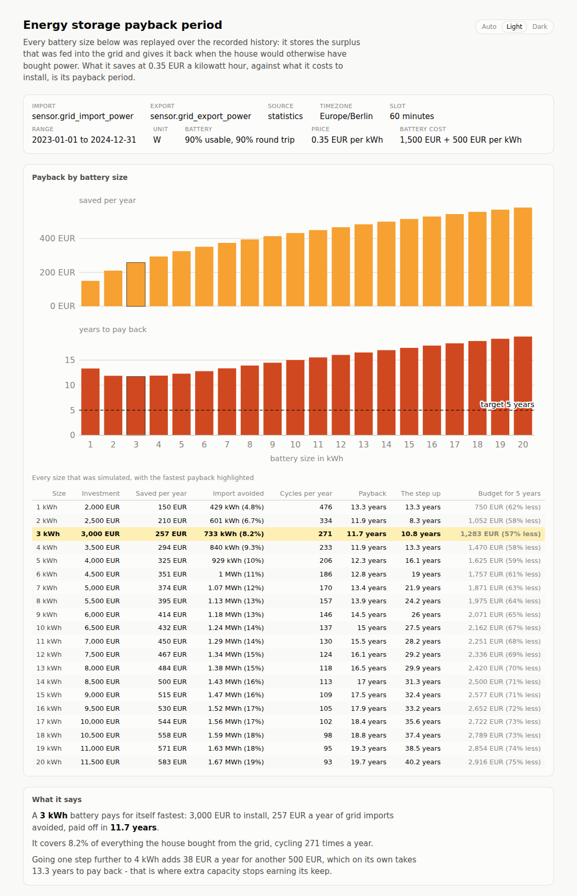

# pv-probability

[](https://github.com/chr1shaefn3r/pv-probability/actions/workflows/ci.yml)

Two command line tools that read a copy of your Home Assistant recorder database and
answer a question about your solar installation as one self-contained HTML report:

| Tool | Question |
|---|---|
| **`pv-probability`** | How much power can I count on, hour by hour and month by month? |
| **[`energy-storage-payback-period`](#energy-storage-payback-period)** | How long would a home battery take to pay for itself? |

Turn a Home Assistant recorder database into "flame graph" heatmaps of how much solar
power you can actually count on, hour by hour, month by month.

One heatmap per month (or per ISO week). The x-axis is the hour of the day, the y-axis is
power in configurable 50 W steps, and each cell answers a single question:

> **How often, historically, was at least this much power available at this hour?**

Very likely is deep red, unlikely fades to yellow, and never blank. Read a column upwards
and the height at which the colour fades is roughly the load you can start at that hour.


The report is one self-contained HTML file: no JavaScript, no web fonts, no network
access. It follows your system's light/dark setting - with an Auto / Light / Dark switch in
the header to override it - reads out the exact figure above the plot as you hover a cell,
and carries a table view of the same numbers under each plot. Under the colour key it
answers the scheduling question directly: [the earliest and latest hour you can count
on](#the-reliable-window).


*(The screenshots come from the synthetic `spotty` demo database described below - half a
year of history with outages in it - not from real production data. The grey strip under
each plot and the "History" block at the foot of the page are what that partial history
looks like; see [Partial history and outages](#partial-history-and-outages).)*

## Quick start

```sh
# 1. Build
cargo build --release

# 2. Take a copy of the recorder database (see "Getting the database" below)
scp homeassistant.local:/config/home-assistant_v2.db ha.db

# 3. Plot
./target/release/pv-probability --db ha.db --entity sensor.solar_power --tz Europe/Berlin
```

It finishes by printing the command that opens the report, ready to paste:

```
wrote pv-probability.html: 12 facets from 17520 readings (730 d), 159 kB, 9.65ms
reliable window: 12:00 to the end of the 13:00 hour - at least 100 W in every recorded minute
covers 2023-01-01 to 2024-12-31 (731 days): 730 days observed, no outage over 24 h

open /home/you/pv-probability.html
```

No Home Assistant to hand? Generate a synthetic one, either solid or full of holes. It
carries a solar power sensor, an energy counter and a pair of grid meters, so both tools
have something to read:

```sh
cargo run --release --example demo_database -- demo.db 730 dense
cargo run --release --example demo_database -- demo.db 165 spotty   # 5 months, outages
cargo run --release --bin pv-probability -- --db demo.db --entity sensor.solar_power \
  --tz Europe/Berlin
cargo run --release --bin energy-storage-payback-period -- --db demo.db \
  --import-entity sensor.grid_import_power --export-entity sensor.grid_export_power
```

## Finding the right entity

Home Assistant usually exposes **two** sensors per device, and only one of them is any use
here:

| Sensor | Unit | `state_class` | What it holds | Plottable |
|---|---|---|---|---|
| `sensor.…_power` | `W` / `kW` | `measurement` | watts right now | **yes** |
| `sensor.…_energy` | `kWh` | `total_increasing` | a running total | no |

The recorder stores them differently: a measurement gets an hourly `mean`, a counter gets a
`sum` and no mean at all, because the average of a running total means nothing. Point this
tool at a counter and there is nothing for it to read - it says so, and names the power
sensor to use instead.

To see what your database holds:

```sh
pv-probability --db ha.db --list-entities          # everything, power sensors first
pv-probability --db ha.db --list-entities solar    # only ids containing "solar"
```

```
Power sensors these tools can read:
  sensor.solar_power   W     3408 rows  2023-01-01 to 2023-06-15

Energy counters (cumulative totals - not plottable, see the README):
  sensor.solar_energy  kWh   3408 rows  2023-01-01 to 2023-06-15
```

`--entity` is not needed when listing. Every error about an entity - unknown, empty, or the
wrong kind - ends with the same shortlist, so the next command is always in front of you.

## Getting the database

The tool only ever opens the file **read-only**, but SQLite still needs a consistent file.
Home Assistant writes continuously, and the recorder runs in WAL mode, so a plain `cp` of
`home-assistant_v2.db` on a running system can miss everything still sitting in the
`-wal` sidecar.

The safe way, from an SSH or Terminal add-on on the Home Assistant machine:

```sh
sqlite3 /config/home-assistant_v2.db ".backup '/config/pv-copy.db'"
```

Then copy `pv-copy.db` off the box (Samba share, `scp`, the File Editor add-on) and point
`--db` at it. On a Home Assistant Green the database lives at `/config/home-assistant_v2.db`
and is typically a few hundred MB.

If you would rather copy the raw file, stop Home Assistant first, or copy
`home-assistant_v2.db`, `home-assistant_v2.db-wal` and `home-assistant_v2.db-shm`
together.

Nothing is ever sent anywhere: the tool is a local CLI that reads SQLite and writes HTML.

## Which data it reads

Home Assistant keeps three different records of a power sensor, and they have very
different retention. `--source auto` (the default) picks the one with the most history:

| Source | Table | Resolution | Retention | Good for |
|---|---|---|---|---|
| `statistics` | `statistics` | one row per hour (`mean`/`min`/`max`) | years | **month and week views** |
| `short-term` | `statistics_short_term` | one row per 5 minutes | ~10 days | recent detail |
| `states` | `states` | every reported change | ~10 days (`purge_keep_days`) | recent detail |

Because the recorder purges raw states after ten days by default, a full year of history
practically has to come from the hourly `statistics` table. That table stores the **mean**
of each hour, so short cloud-edge spikes are smoothed away; `--stat max` shows the peak
within each hour instead, and `--stat min` the floor.

Both the modern schema (epoch timestamps, `states_meta`) and the pre-2023 schema (text
timestamps, `states.entity_id`) are detected automatically.

If the entity name is wrong - or right but unusable - the error says which, and lists the
power sensors that would work. See [Finding the right entity](#finding-the-right-entity).

## Partial history and outages

This is written for a real recorder database, which is rarely a tidy block of years. Less
than a year of history, and holes in the middle of it, are the normal case.

**What the tool does about it**

* **Months you have no data for are simply absent** from the report - not drawn empty, not
  guessed at. The header names any that are missing from a span that could have contained
  them.
* **Evidence is counted in distinct local days, never in readings.** One sunny morning can
  be six readings from the hourly statistics table or six hundred from `states`; it is one
  day of evidence either way. Any (month, hour) column backed by fewer than `--min-days`
  days (default 3) is **hatched rather than coloured**, so a single February morning cannot
  masquerade as a settled 100%.
* **Hours the recorder never covered are hatched differently** from hours it covered only
  briefly, so "we know nothing about 03:00" is distinguishable from "we have two days of
  03:00".
* **A coverage strip under every heatmap** shows, hour by hour, how many distinct days back
  that column, shaded on a neutral grey scale and exact on hover. The panel caption states
  the same thing for the month as a whole ("26 of 31 days").
* **The header reports the real span and the outages in it**: how many days carry data, how
  many were recorded right through the day, how many outages longer than
  `--gap-threshold-hours` (default 24) interrupted it, and how long the worst one was. The
  same summary goes to stdout, with every outage listed under `-v`.

**What it cannot do about it**

Every percentage is conditional on the time that was actually recorded. If the recorder was
down through a sunny week in July, that week is not represented at all, and July's numbers
describe the days that survived rather than July. No amount of arithmetic fixes that; the
coverage strip and the outage summary are there so you can see when it applies.

Two knobs are worth knowing:

* `--min-days 1` shows everything, however thin. `--min-days 10` is strict.
* `--gap-threshold-hours 6` catches shorter outages. The default of 24 exists because many
  inverters report `unavailable` all night, and a 14 hour nightly hole would otherwise fill
  the report with "outages". If your sensor reports 0 W at night instead, lower it.

## How the numbers are computed

* **Time-weighted, not row-weighted.** Every reading is weighted by how long it was in
  effect, so a sensor that reports rapidly at noon and rarely at dusk does not skew the
  result. Raw states are carried forward until the next reading, capped at `--max-gap`
  (default 15 minutes) so a recorder outage is not counted as hours of steady production.
  A statistics row counts as its hour, a short-term row as its five minutes.
* **Split at local hour boundaries.** A reading in effect from 13:50 to 14:20 contributes
  10 minutes to hour 13 and 20 minutes to hour 14.
* **Daylight saving is handled honestly.** Hours are local wall-clock hours in `--tz`. On
  the spring-forward day the missing local hour gets no weight; on the fall-back day the
  repeated hour gets both passes. That is what you want when the question is "at 14:00,
  what can I run?".
* **Exceedance by default.** Cell = `P(watts >= the bucket's lower edge)`, computed as a
  reverse cumulative sum over the power axis and normalised by the observed time of that
  hour. This is what gives the plot its flame shape. `--metric density` switches to
  `P(watts inside the bucket)` instead, where each column sums to 100%.
* **The exceedance axis starts one step up.** "At least 0 W" is true whenever the hour was
  observed at all, so drawing it would paint a certainty band across the night.
* **Thin columns are marked, not guessed.** Evidence is counted in distinct local days, so
  an hour backed by fewer than `--min-days` of them is hatched rather than coloured however
  many rows the recorder wrote. See [Partial history and outages](#partial-history-and-outages).
* **Facets pool across years.** Every June in the database contributes to the June
  heatmap; that is the point of asking about likelihood. Narrow the window with `--from` /
  `--to` if you want a single season.

## The reliable window

The heatmaps show what is *likely*; a load schedule needs to know what is *safe*. The
**Reliable window** block, between the colour key and the History section, names the
earliest and the latest hour of the day that reach a given power - by default 100 W - in
every recorded minute:

```
Earliest 12:00, latest 13:00: across the whole record at least 100 W is available in
every recorded minute of those hours. The window runs from 12:00 to the end of the
13:00 hour.
```

The same sentence appears for each individual month or week, at the top of that panel's
expandable table, so "when can I run this in November?" is answered in the panel itself.
The line printed after a run carries the overall figure too.

* `--reliable-watts <W>` sets the power. It is rounded **up** to a bucket edge - asking
  for 120 W with 50 W steps is answered from the "at least 150 W" row, never from the
  100 W one, which would overstate the claim - and the block says so when it rounds.
* `--reliable-probability <P>` sets how strict "always" is. At the default of `1` a
  single recorded hour below the threshold rules that hour of the day out for good, which
  on a patchy history often leaves no window at all. That is the honest answer, and the
  report says it in words rather than showing an empty range; `--reliable-probability 0.9`
  then asks the useful follow-up question.
* Hours the `--min-days` rule considers too thin never qualify: two sunny mornings are not
  a guarantee.
* The overall figure pools every month, weighted by how much of each was actually
  recorded. At `--reliable-probability 1` that is exactly the intersection of the monthly
  windows, so the whole record can only promise what its worst month promises - and when
  the months clear the bar at different hours, the pooled window can be empty while no
  single month is. The block explains that where it happens.

## Options (pv-probability)

```
pv-probability --db <FILE> --entity <ENTITY_ID> [OPTIONS]
```

| Option | Default | What it does |
|---|---|---|
| `--db <FILE>` | required | Copy of `home-assistant_v2.db`, opened read-only |
| `--entity <ID>` | required | `sensor.solar_power`; also accepted as a `statistic_id` |
| `--list-entities [FILTER]` | off | List what the database holds and exit, power sensors first |
| `--group <month\|week>` | `month` | One heatmap per calendar month or per ISO week |
| `--step-watts <W>` | `50` | Height of one power bucket |
| `--max-watts <W>` | auto | Top of the power axis; everything above lands in the top bucket |
| `--max-quantile <Q>` | `0.999` | Quantile used to pick the axis when `--max-watts` is absent |
| `--source <auto\|statistics\|short-term\|states>` | `auto` | Which recorder table to read |
| `--stat <mean\|min\|max>` | `mean` | Which statistics column to use |
| `--tz <TZ>` | machine zone | IANA timezone for the hour axis, e.g. `Europe/Berlin` |
| `--from <YYYY-MM-DD>` / `--to <YYYY-MM-DD>` | all data | Local date window, `--to` exclusive |
| `--metric <exceedance\|density>` | `exceedance` | Cell meaning |
| `--min-days <N>` | `3` | Hours backed by fewer distinct days are hatched, not coloured |
| `--gap-threshold-hours <H>` | `24` | Outages at least this long are reported |
| `--reliable-watts <W>` | `100` | Power the [reliable window](#the-reliable-window) asks about |
| `--reliable-probability <P>` | `1` | Share of recorded time that has to reach it; `1` means always |
| `--min-probability <P>` | `0.005` | Cells below this are left blank |
| `--gamma <G>` | `0.6` | Ramp shaping; below 1 lifts rare-but-real cells into view |
| `--levels <N>` | `10` | Colour steps on the likelihood scale (3-16) |
| `--max-gap <SECONDS>` | `900` | How long one raw state reading is assumed to hold |
| `--scale <FACTOR>` | auto | Multiply readings; `kW`/`MW` units are converted automatically |
| `--keep-negative` | off | Keep negative readings instead of clamping them to zero |
| `--threads <N>` | one per core | Cap the rayon worker threads |
| `-o, --out <FILE>` | `pv-probability.html` | Where to write the report |
| `-v` | off | Print row counts and timings |

`--help` prints the same list with the full descriptions.

### Examples

```sh
# Weekly resolution, 100 W buckets, only last year
pv-probability --db ha.db --entity sensor.solar_power --group week \
  --step-watts 100 --from 2025-01-01 --to 2026-01-01 --tz Europe/Berlin

# What is the peak within each hour, rather than the hourly average?
pv-probability --db ha.db --entity sensor.solar_power --stat max

# High-resolution look at the last ten days from the raw states table
pv-probability --db ha.db --entity sensor.solar_power --source states --group week

# A sensor that reports kilowatts but has no unit recorded
pv-probability --db ha.db --entity sensor.pv_now --scale 1000

# When can I count on 500 W nine days out of ten?
pv-probability --db ha.db --entity sensor.solar_power \
  --reliable-watts 500 --reliable-probability 0.9
```

## energy-storage-payback-period

The same database usually holds two more sensors: the **power drawn from the grid** and
the **power fed back into it**. Everything fed back is given away; everything drawn is
paid for. A battery turns the first into the second - it stores the midday surplus and
returns it in the evening - so its worth is simply the grid import it avoids.

```sh
energy-storage-payback-period --db ha.db \
  --import-entity sensor.grid_import_power \
  --export-entity sensor.grid_export_power \
  --tz Europe/Berlin --price-per-kwh 0.35
```

```
wrote energy-storage-payback-period.html: 20 sizes over 17520 slots of 60 minutes, 25 kB, 36.5ms
measured 17.97 MWh imported and 4.32 MWh exported
best payback: 3 kWh for 3,000 EUR saves 257 EUR a year - paid off in 11.7 years
for 5 years: it would have to cost 1,283 EUR instead of 3,000 EUR (57% less), which the 1,500 EUR base cost alone already exceeds
covers 2023-01-01 to 2024-12-31 (731 days): 731 days paired (730 of them full days), 0 outages over 24 h

open /home/you/energy-storage-payback-period.html
```

The report charts annual savings and payback period against battery size, names the size
that pays back fastest and the point where further capacity stops earning its keep, and
shows what the answer becomes at other electricity prices and other quotes. It also runs
the sum backwards: **how cheap the installation would have to be** to pay back within
`--target-payback-years` (5 by default).



*(From the same synthetic demo database, so the prices and the array are made up - but the
arithmetic and the simulation are the real ones.)*

**Both sensors must be power sensors in watts** - the same kind the heatmap tool plots.
A kilowatt-hour counter has no `mean` for the recorder to store, and passing one gets the
same diagnosis the heatmap tool gives, naming the `_power` sensor beside it.
`--list-entities` prints what the database holds, power sensors first.

### How the simulation works

* Each sensor is integrated into energy per slot (`--slot-minutes`, hourly by default,
  which is as fine as a full year of statistics gets). A reading of *w* watts in effect for
  *s* seconds is `w * s / 3 600 000` kWh, so an hourly mean and a chatty `states` history
  give the same answer.
* Only slots **both** sensors really covered are simulated (`--min-slot-coverage`); the
  rest are counted and reported. A battery cannot be sized against a surplus nobody
  recorded.
* Each slot serves the import first and charges from what is left of the export
  afterwards, respecting `--usable-fraction`, `--round-trip` and the optional
  `--max-charge-kw` / `--max-discharge-kw`. Import and export inside one slot are *not*
  netted off: had they been simultaneous the house would never have imported at all.
* Savings are `avoided import x --price-per-kwh`, less `--feed-in-price` for the export the
  battery swallowed - zero by default, because the export is gifted.
* Payback is `(--base-cost + --cost-per-kwh x capacity) / annual savings`. No price
  escalation, no degradation, no discount rate: the sensitivity block shows what moving the
  price or the quote does instead.
* The same sum read backwards gives the **budget**: to pay back within
  `--target-payback-years`, an installation may cost at most `target x annual savings`.
  Each row of the table carries that figure and how far the quote would have to fall to
  meet it; the block below the table works it through for the size that comes closest, and
  says when `--base-cost` alone already exceeds the budget - the case no cell price, not
  even zero, can fix.
* A history shorter than a year is scaled up to one **and** flagged. A summer-heavy
  history flatters a battery; a winter-heavy one does the opposite.
* These sensors show what crossed the meter, not what the house used or the roof made, so
  the report says *grid import avoided* and never claims a self-sufficiency figure.

### Options

| Option | Default | What it does |
|---|---|---|
| `--db <FILE>` | required | Copy of `home-assistant_v2.db`, opened read-only |
| `--import-entity <ID>` | required | Power sensor for energy drawn from the grid |
| `--export-entity <ID>` | required | Power sensor for energy fed back |
| `--list-entities [FILTER]` | off | List what the database holds and exit |
| `--price-per-kwh <P>` | `0.35` | What a kilowatt hour from the grid costs |
| `--feed-in-price <P>` | `0` | What a kilowatt hour fed back earns |
| `--cost-per-kwh <C>` | `500` | Installed battery cost per kWh of capacity |
| `--base-cost <C>` | `1500` | The part of the bill that does not scale with capacity |
| `--currency <SYMBOL>` | `EUR` | Currency symbol used in the report |
| `--min-size` / `--max-size` / `--size-step` | `1` / `20` / `1` | The sizes to try, in kWh |
| `--sizes <LIST>` | off | Exact sizes instead of the range, e.g. `5,10,13.5` |
| `--round-trip <F>` | `0.9` | Round trip efficiency, charged half on each side |
| `--usable-fraction <F>` | `0.9` | Share of the nameplate actually cycled |
| `--max-charge-kw` / `--max-discharge-kw` | unlimited | Inverter power ceilings |
| `--slot-minutes <M>` | `60` | Simulation slot length; must divide an hour |
| `--min-slot-coverage <F>` | `0.9` | How much of a slot both sensors must have covered |
| `--sensitivity <PCT>` | `25` | How far either side the sensitivity grid looks |
| `--target-payback-years <Y>` | `5` | The payback period the budget is worked back from |
| `--source` / `--stat` / `--scale` / `--max-gap` | as above | Shared with `pv-probability` |
| `--tz` / `--from` / `--to` | as above | Timezone and date window |
| `--gap-threshold-hours <H>` | `24` | Outages at least this long are reported |
| `--threads <N>` | one per core | Cap the rayon worker threads |
| `-o, --out <FILE>` | `energy-storage-payback-period.html` | Where to write the report |
| `-v` | off | Print row counts, thread count and timings |

```sh
# Real quotes for the two sizes actually on offer, at next year's price
energy-storage-payback-period --db ha.db \
  --import-entity sensor.grid_import_power --export-entity sensor.grid_export_power \
  --sizes 6.5,13 --base-cost 2200 --cost-per-kwh 430 --price-per-kwh 0.42

# How much does hourly resolution flatter the battery? Check against the last ten days
energy-storage-payback-period --db ha.db \
  --import-entity sensor.grid_import_power --export-entity sensor.grid_export_power \
  --source short-term --slot-minutes 5

# What would it have to cost to be square in three years?
energy-storage-payback-period --db ha.db \
  --import-entity sensor.grid_import_power --export-entity sensor.grid_export_power \
  --target-payback-years 3
```

## Performance

Reading is single-threaded (SQLite), everything after it is parallel: samples are folded
into per-facet histograms with rayon (`par_chunks` + `reduce`, since the histograms are
additive), the power axis quantile uses a parallel sort, and the facets are rendered
concurrently. Two years of hourly statistics (17 520 rows, 129 buckets) load, aggregate
and render in under 10 ms on a laptop core; the work scales linearly, so even a
five-minute-resolution decade stays interactive. `--threads` caps the pool if you want to
leave cores free.

The payback tool reads its two sensors on two connections at once, folds each into slots
with the same `par_chunks` + `reduce` shape, and then simulates every battery size in
parallel. A battery's state of charge makes one simulation inherently sequential, so the
sizes are the unit of parallelism: 391 sizes over two years of hourly slots take 48 ms on
four cores against 186 ms on one, so a sweep as fine as `--size-step 0.1` costs no more
wall-clock time than a coarse one until it runs out of cores.

## Development

```sh
cargo test                                        # 290+ unit and integration tests
cargo clippy --all-targets --all-features -- -D warnings
cargo fmt --all
```

The test suite never touches a real Home Assistant: `src/source/testdb.rs` builds
synthetic recorder databases in both schema generations, including a reproducible
synthetic solar year - with or without outages - used by `tests/end_to_end.rs` and
`tests/payback.rs`. GitHub Actions runs formatting, clippy
and the whole suite on every push to `main` and on every pull request
(`.github/workflows/ci.yml`).

Layout:

| Path | Contents |
|---|---|
| `src/cli.rs` | Command line surface and validation (`src/storage/cli.rs` for the other tool) |
| `src/timeutil.rs` | Timezone resolution, DST-safe hour splitting |
| `src/model.rs` | `Sample`, `BucketSpec`, the additive `Grid` |
| `src/source/` | Schema probing, the statistics / states readers, the entity catalogue |
| `src/aggregate.rs` | Parallel folding, exceedance and density |
| `src/coverage.rs` | Outage detection and what the history really covers |
| `src/storage/` | Slot energy accounting, the battery simulation and the size sweep |
| `src/render/` | Colour scale, per-facet SVG, the shared page shell, both reports |
| `src/bin/energy-storage-payback-period.rs` | The payback tool's entry point |
| `examples/demo_database.rs` | Writes a synthetic recorder database |

## Colour scale

The ramp is a semantic heat scale, monotone in perceived lightness so it survives
greyscale printing and colour vision deficiencies: light mode runs pale yellow to deep
red (OKLCH lightness 0.95 down to 0.43), dark mode runs dim ochre to bright red (0.34 up
to 0.65). In both themes "unlikely" recedes towards the page and "likely" stands out. The
legend spells out the probability range of every step, and the table view under each plot
gives the same numbers as text.

## Licence

MIT - see [LICENSE](LICENSE).
