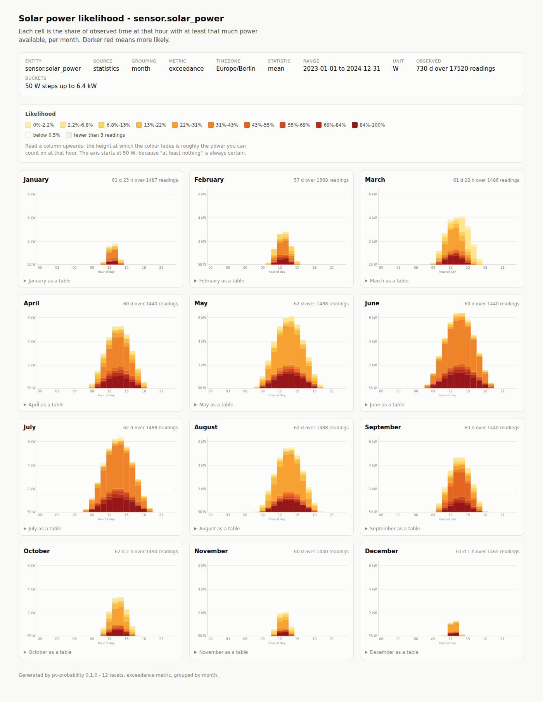
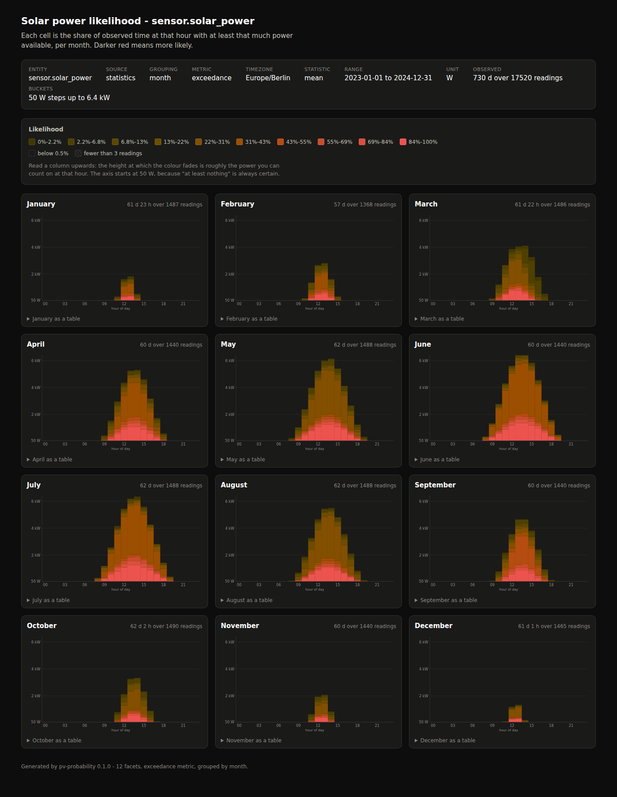

# pv-probability

[](https://github.com/chr1shaefn3r/pv-probability/actions/workflows/ci.yml)

Turn a Home Assistant recorder database into "flame graph" heatmaps of how much solar
power you can actually count on, hour by hour, month by month.

One heatmap per month (or per ISO week). The x-axis is the hour of the day, the y-axis is
power in configurable 50 W steps, and each cell answers a single question:

> **How often, historically, was at least this much power available at this hour?**

Very likely is deep red, unlikely fades to yellow, and never blank. Read a column upwards
and the height at which the colour fades is roughly the load you can start at that hour.



The report is one self-contained HTML file: no JavaScript, no web fonts, no network
access. It follows your system's light/dark setting, has hover tooltips on every cell, and
carries a table view of the same numbers under each plot.



*(The screenshots are generated from the synthetic demo database described below, not from
real production data.)*

## Quick start

```sh
# 1. Build
cargo build --release

# 2. Take a copy of the recorder database (see "Getting the database" below)
scp homeassistant.local:/config/home-assistant_v2.db ha.db

# 3. Plot
./target/release/pv-probability --db ha.db --entity sensor.solar_power --tz Europe/Berlin

# 4. Open pv-probability.html in a browser
```

No Home Assistant to hand? Generate a synthetic one:

```sh
cargo run --release --example demo_database -- demo.db 730
cargo run --release -- --db demo.db --entity sensor.solar_power --tz Europe/Berlin
```

## Getting the database

The tool only ever opens the file **read-only**, but SQLite still needs a consistent file.
Home Assistant writes continuously, and the recorder runs in WAL mode, so a plain `cp` of
`home-assistant_v2.db` on a running system can miss everything still sitting in the
`-wal` sidecar.

The safe way, from an SSH or Terminal add-on on the Home Assistant machine:

```sh
sqlite3 /config/home-assistant_v2.db ".backup '/config/pv-copy.db'"
```

Then copy `pv-copy.db` off the box (Samba share, `scp`, the File Editor add-on) and point
`--db` at it. On a Home Assistant Green the database lives at `/config/home-assistant_v2.db`
and is typically a few hundred MB.

If you would rather copy the raw file, stop Home Assistant first, or copy
`home-assistant_v2.db`, `home-assistant_v2.db-wal` and `home-assistant_v2.db-shm`
together.

Nothing is ever sent anywhere: the tool is a local CLI that reads SQLite and writes HTML.

## Which data it reads

Home Assistant keeps three different records of a power sensor, and they have very
different retention. `--source auto` (the default) picks the one with the most history:

| Source | Table | Resolution | Retention | Good for |
|---|---|---|---|---|
| `statistics` | `statistics` | one row per hour (`mean`/`min`/`max`) | years | **month and week views** |
| `short-term` | `statistics_short_term` | one row per 5 minutes | ~10 days | recent detail |
| `states` | `states` | every reported change | ~10 days (`purge_keep_days`) | recent detail |

Because the recorder purges raw states after ten days by default, a full year of history
practically has to come from the hourly `statistics` table. That table stores the **mean**
of each hour, so short cloud-edge spikes are smoothed away; `--stat max` shows the peak
within each hour instead, and `--stat min` the floor.

Both the modern schema (epoch timestamps, `states_meta`) and the pre-2023 schema (text
timestamps, `states.entity_id`) are detected automatically.

If the entity name is wrong, the error lists the ids in the database that look similar.

## How the numbers are computed

* **Time-weighted, not row-weighted.** Every reading is weighted by how long it was in
  effect, so a sensor that reports rapidly at noon and rarely at dusk does not skew the
  result. Raw states are carried forward until the next reading, capped at `--max-gap`
  (default 15 minutes) so a recorder outage is not counted as hours of steady production.
  A statistics row counts as its hour, a short-term row as its five minutes.
* **Split at local hour boundaries.** A reading in effect from 13:50 to 14:20 contributes
  10 minutes to hour 13 and 20 minutes to hour 14.
* **Daylight saving is handled honestly.** Hours are local wall-clock hours in `--tz`. On
  the spring-forward day the missing local hour gets no weight; on the fall-back day the
  repeated hour gets both passes. That is what you want when the question is "at 14:00,
  what can I run?".
* **Exceedance by default.** Cell = `P(watts >= the bucket's lower edge)`, computed as a
  reverse cumulative sum over the power axis and normalised by the observed time of that
  hour. This is what gives the plot its flame shape. `--metric density` switches to
  `P(watts inside the bucket)` instead, where each column sums to 100%.
* **The exceedance axis starts one step up.** "At least 0 W" is true whenever the hour was
  observed at all, so drawing it would paint a certainty band across the night.
* **Thin columns are marked, not guessed.** An hour with fewer than `--min-samples`
  readings is hatched rather than coloured, so a single sunny February morning cannot
  masquerade as a 100% certainty.
* **Facets pool across years.** Every June in the database contributes to the June
  heatmap; that is the point of asking about likelihood. Narrow the window with `--from` /
  `--to` if you want a single season.

## Options

```
pv-probability --db <FILE> --entity <ENTITY_ID> [OPTIONS]
```

| Option | Default | What it does |
|---|---|---|
| `--db <FILE>` | required | Copy of `home-assistant_v2.db`, opened read-only |
| `--entity <ID>` | required | `sensor.solar_power`; also accepted as a `statistic_id` |
| `--group <month\|week>` | `month` | One heatmap per calendar month or per ISO week |
| `--step-watts <W>` | `50` | Height of one power bucket |
| `--max-watts <W>` | auto | Top of the power axis; everything above lands in the top bucket |
| `--max-quantile <Q>` | `0.999` | Quantile used to pick the axis when `--max-watts` is absent |
| `--source <auto\|statistics\|short-term\|states>` | `auto` | Which recorder table to read |
| `--stat <mean\|min\|max>` | `mean` | Which statistics column to use |
| `--tz <TZ>` | machine zone | IANA timezone for the hour axis, e.g. `Europe/Berlin` |
| `--from <YYYY-MM-DD>` / `--to <YYYY-MM-DD>` | all data | Local date window, `--to` exclusive |
| `--metric <exceedance\|density>` | `exceedance` | Cell meaning |
| `--min-samples <N>` | `3` | Below this, a column is drawn as "not enough data" |
| `--min-probability <P>` | `0.005` | Cells below this are left blank |
| `--gamma <G>` | `0.6` | Ramp shaping; below 1 lifts rare-but-real cells into view |
| `--levels <N>` | `10` | Colour steps on the likelihood scale (3-16) |
| `--max-gap <SECONDS>` | `900` | How long one raw state reading is assumed to hold |
| `--scale <FACTOR>` | auto | Multiply readings; `kW`/`MW` units are converted automatically |
| `--keep-negative` | off | Keep negative readings instead of clamping them to zero |
| `--threads <N>` | one per core | Cap the rayon worker threads |
| `-o, --out <FILE>` | `pv-probability.html` | Where to write the report |
| `-v` | off | Print row counts and timings |

`--help` prints the same list with the full descriptions.

### Examples

```sh
# Weekly resolution, 100 W buckets, only last year
pv-probability --db ha.db --entity sensor.solar_power --group week \
  --step-watts 100 --from 2025-01-01 --to 2026-01-01 --tz Europe/Berlin

# What is the peak within each hour, rather than the hourly average?
pv-probability --db ha.db --entity sensor.solar_power --stat max

# High-resolution look at the last ten days from the raw states table
pv-probability --db ha.db --entity sensor.solar_power --source states --group week

# A sensor that reports kilowatts but has no unit recorded
pv-probability --db ha.db --entity sensor.pv_now --scale 1000
```

## Performance

Reading is single-threaded (SQLite), everything after it is parallel: samples are folded
into per-facet histograms with rayon (`par_chunks` + `reduce`, since the histograms are
additive), the power axis quantile uses a parallel sort, and the facets are rendered
concurrently. Two years of hourly statistics (17 520 rows, 129 buckets) load, aggregate
and render in under 10 ms on a laptop core; the work scales linearly, so even a
five-minute-resolution decade stays interactive. `--threads` caps the pool if you want to
leave cores free.

## Development

```sh
cargo test                                        # 130+ unit and integration tests
cargo clippy --all-targets --all-features -- -D warnings
cargo fmt --all
```

The test suite never touches a real Home Assistant: `src/source/testdb.rs` builds
synthetic recorder databases in both schema generations, including a reproducible
synthetic solar year used by `tests/end_to_end.rs`. GitHub Actions runs formatting, clippy
and the whole suite on every push to `main` and on every pull request
(`.github/workflows/ci.yml`).

Layout:

| Path | Contents |
|---|---|
| `src/cli.rs` | Command line surface and validation |
| `src/timeutil.rs` | Timezone resolution, DST-safe hour splitting |
| `src/model.rs` | `Sample`, `BucketSpec`, the additive `Grid` |
| `src/source/` | Schema probing and the statistics / states readers |
| `src/aggregate.rs` | Parallel folding, exceedance and density |
| `src/render/` | Colour scale, per-facet SVG, the HTML page |
| `examples/demo_database.rs` | Writes a synthetic recorder database |

## Colour scale

The ramp is a semantic heat scale, monotone in perceived lightness so it survives
greyscale printing and colour vision deficiencies: light mode runs pale yellow to deep
red (OKLCH lightness 0.95 down to 0.43), dark mode runs dim ochre to bright red (0.34 up
to 0.65). In both themes "unlikely" recedes towards the page and "likely" stands out. The
legend spells out the probability range of every step, and the table view under each plot
gives the same numbers as text.

## Licence

MIT - see [LICENSE](LICENSE).
